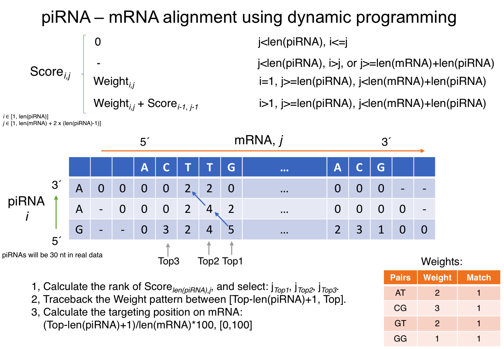
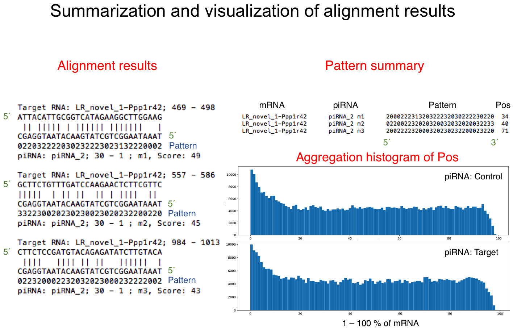

# piTargetClassifier
A classifier for piRNA-mRNA pairing, based on an experimental data.

## Software design

## Package requirements

```
argparse
numpy
scikit-learn
matplotlib
```

## Pairing strategy


## Usage
```
#Show the manual page
python3 piTargetClassifier.py

***********************************************************************
*                Welcome to use piTargetClassifier                    *
*                        Y. Sun, 2018-11                              *
***********************************************************************
-h , --help                          Show manual
Demo mode (--Demo)
      Demo mode uses the prepared files in ./demo.
      No other inputs needed. This will take 1 min to run.
Align mode (--Align)
           -v        INT             Verbosity, [1, 2, 3]
      Perform de novo alignments:
           -p, -pi   FILE            piRNA FASTA file
           -c, -mc   FILE            Control mRNA FASTA file
           -t, -mt   FILE            Target mRNA FASTA file
           -w        Weight/FILE     Weight: 'match' or 'hy'
                                      or an additional file
           -o        Prefix          Prefix of output files
      or Use ready-to-use aligned results:
           --import  Prefix          Prefix of pre-aligned data
Learn mode (--Learn)
           --TestFrac                Test data set fraction
           -l, --logi                Use logistic regression
               --CVNum INT           (Optional) Cross Validation N
           -r, --rf                  Use random forest classifier
               --TNum  INT           (Optional) Tree Number N
               --Depth INT           (Optional) Tree Depth N
           -s, --svm                 Use SVM classifier
               --Cpen  INT           (Optional) SVM penalty C
           -a, --all                 Use all above three methods
           -m, --mode  MODE          (Optional) All/Best/AllBest modes.
Predict mode (--Predict)
           --prealign                pre-aligned pattern file
           --preout                  Prefix of the output file

Demo or Align mode can be run separately.
Align+Learn, or Align+Learn+Predict modes can be run together.
For Align mode, please pick one sub-mode: de novo or import.
    within each sub-mode, all arguments are required
For Learn mode, one or more modes can be used. Default none.
For Predict mode, the input contains only a single pattern column.
    The output file is Predictfile.pre.txt
Default optional values: CVNum=5, TNum=100, Depth=8, Cpen=1, mode=All
               TestFrac=0.05
***********************************************************************

2, Run Demo mode:
python3 piTargetClassifier.py --Demo

#Demo mode uses pre-set parameters which are same as the following command:
python3 piTargetClassifier.py --Align -v 1 -p ./demo/demo.piRNA.fa -c ./demo/demo.Control.fa -t ./demo/demo.Target.fa -o DemoRun --TestFrac 0.33 -w ./demo/weight.hy.txt --Learn -a -m AllBest --Predict --prealign ./demo/demo.UnknownPatterns.txt --preout DemoPre
```

## Results

